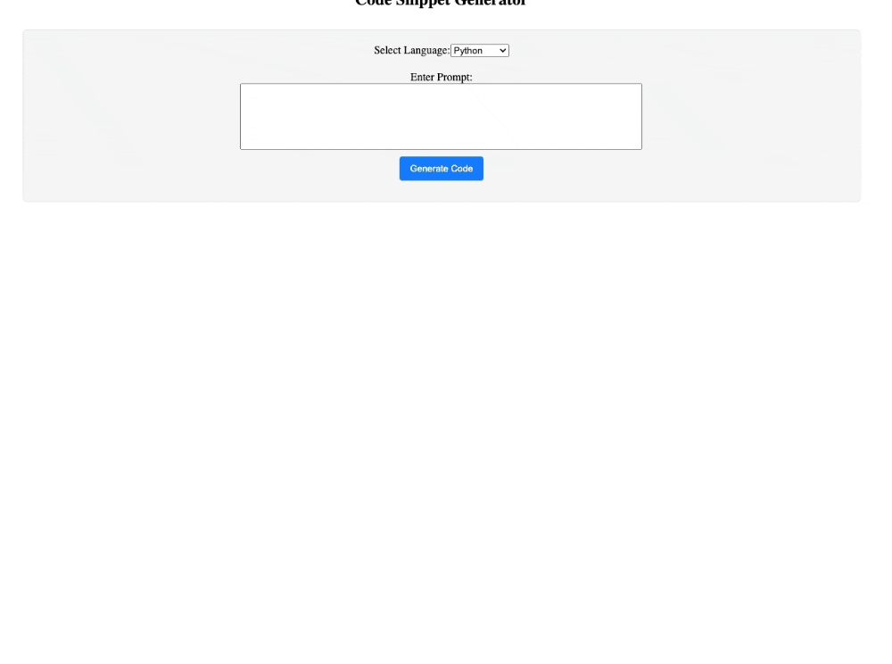
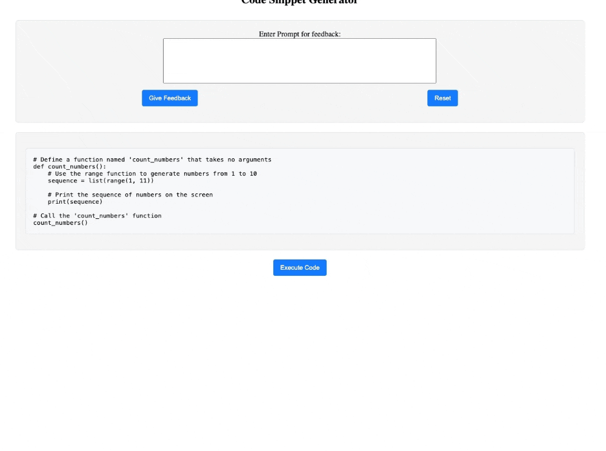
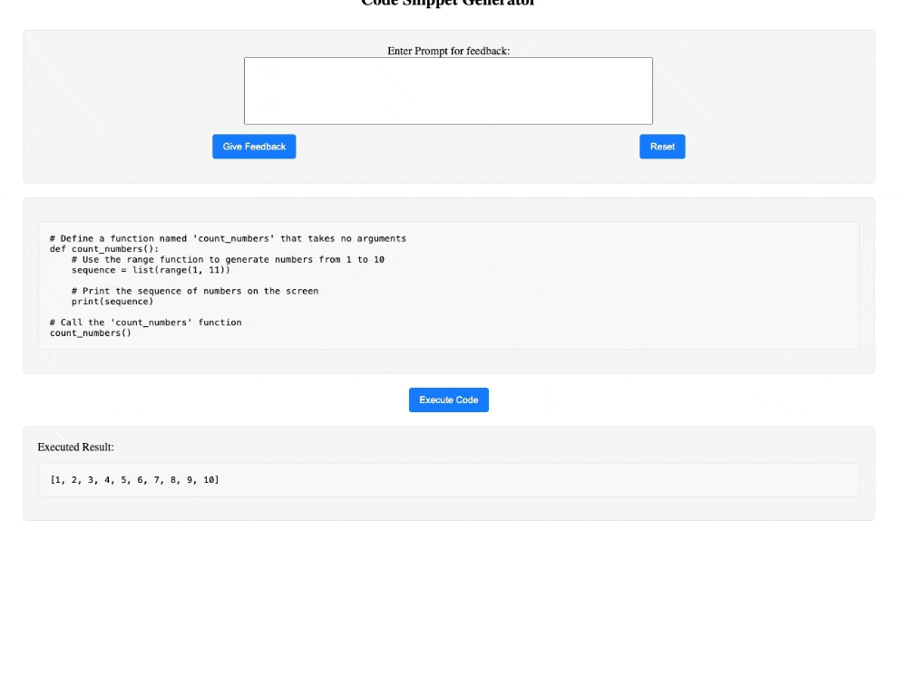
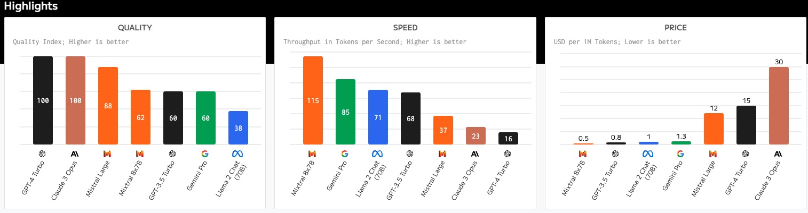
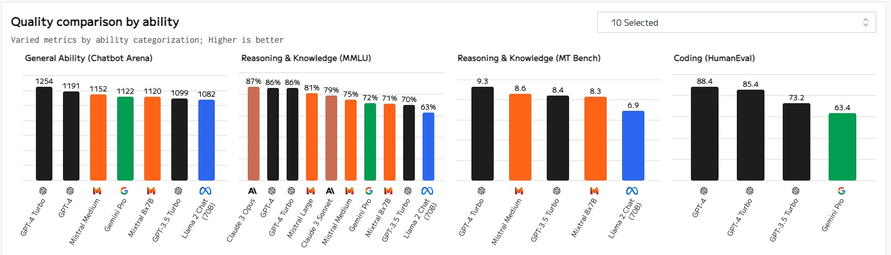

# Code Snippet Generator Documentation

This application is designed to help users quickly generate code snippets for various programming languages. It simplifies the process of writing repetitive code patterns by providing a user-friendly interface where users can select the type of snippet they need, customize it according to their requirements, and then easily copy the generated code for use in their projects.

## Requirements

To run the Code Snippet Generator, you will need to fulfill the following minimum requirements:

### Backend

- Python 3.10

### Frontend

- Angular CLI: 17.3.0
- Node: 18.19.0

### LLM

NB! To run LLM locally, make sure you have GPU support enabled in your local machine.

## Installation

### Backend environment setup

To set up the backend environment, follow these steps:

```bash
cd backend
pip install -r requirements.txt
```

### Frontend environment setup

To set up the frontend environment, follow these steps:

```bash
cd frontend
npm install
```

### Running LLM Locally

To run the LLM locally, follow these steps:

1. Install `Ollama` from its [official website](https://ollama.com/).
2. Run the following command in the terminal:

    ```bash
    ollama pull mistral
    ```

3. Run the following command to see the list of LLM:

    ```bash
    ollama list

    # Can see the information of the LLM like this:
    NAME          	ID          	SIZE  	MODIFIED
    mistral:latest	61e88e884507	4.1 GB	5 days ago
    ```

4. Run the following command to make sure that you downloaded the LLM in local successfully:

    ```bash
    ollama pull mistral

    # input text after '>>>' and get output:
    >>> Hello, world!
    Hello! ................
    ```

## Quick Start

### Initiate backend

To start the backend, run the following command in the terminal:

```bash
cd backend
uvicorn api:app --reload

# If running successfully, you should see the following similar output:
# INFO:     Will watch for changes in these directories: ['your/backend/path']
# INFO:     Uvicorn running on http://127.0.0.1:8000 (Press CTRL+C to quit)
# INFO:     Started reloader process [30546] using StatReload
# INFO:     Started server process [30548]
# INFO:     Waiting for application startup.
# INFO:     Application startup complete.
```

### Initiate frontend

To start the frontend, run the following command in the terminal:

```bash
cd frontend
npm run start

# If running successfully, you should see the following similar output:
# > frontend@0.0.0 start
# > ng serve
# 
# Initial chunk files | Names         | Raw size
# polyfills.js        | polyfills     | 83.60 kB |
# main.js             | main          | 15.81 kB |
# styles.css          | styles        | 96 bytes |
# 
#                     | Initial total | 99.50 kB
# 
# Application bundle generation complete. [1.109 seconds]
# 
# Watch mode enabled. Watching for file changes...
# Re-optimizing dependencies because vite config has changed
#   ➜  Local:   http://localhost:4200/
#   ➜  press h + enter to show help
```

## Usage

### Generate code snippet

If you run this application locally, you can to the default frontend URL (http://localhost:4200/) in your browser and start generating code snippets.

You can select the programming language you want to generate code snippets. Once you enter the validated prompt, click the `Generate Code` to generate code snippets.



When LLM is finished generating code snippets, you will see the code snippets in the page, then you can click the `Execute Code` to execute code snippets to evaluate the generated code snippets.



You also can give the feedback to the LLM to generate code snippets according to your feedback. Or `Reset` to reset the code snippets.



## LLM selection

The LLM model `Mistral` is chosen for its exceptional ability to understand and generate natural language, making it an ideal choice for applications requiring high-quality text generation. Its advanced algorithms allow for more nuanced and contextually relevant outputs compared to other open-source models. This makes `Mistral` particularly useful for generating code snippets, where precision and adherence to programming language syntax are crucial. Additionally, Mistral's efficiency in processing and generating text helps in reducing the overall response time, enhancing the user experience by providing quick and accurate code generation.





References: 1. [LLM Analysis](https://artificialanalysis.ai/models)

## Docker Usage

NB! To run the Docker, please make sure you have NVIDIA GPU and CUDA installed, also setup environment follow this (link)[https://docs.nvidia.com/datacenter/cloud-native/container-toolkit/latest/install-guide.html#configuring-docker].

To run docker containers for frontend and backend application, please run the following command:

```bash
docker compose up
```